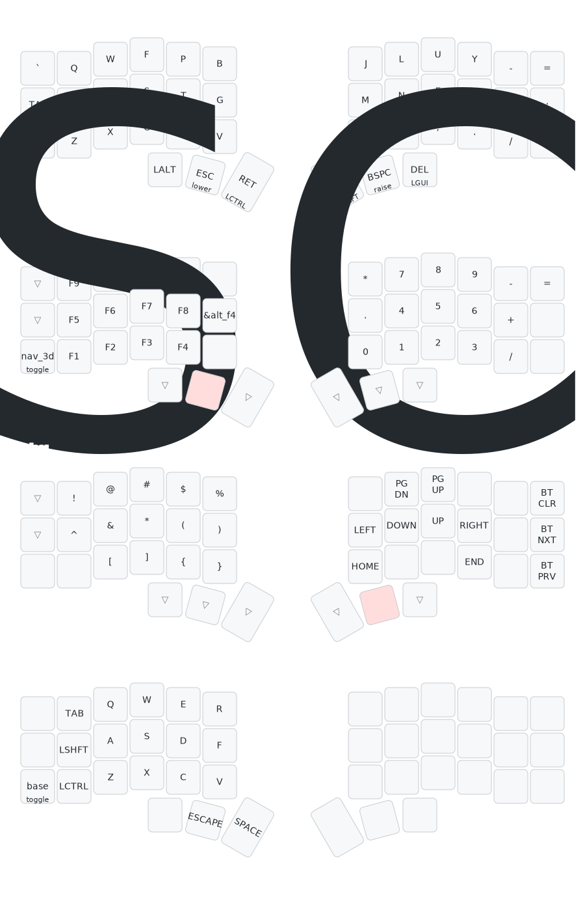

# My Corne keyboard layout and configuration

## Rationale:

In my search for a custom layout that suited my needs, I experimented with home row mods. However, the combination of the steep learning curve and the strange sensation caused by variable latency when tapping the home row keys never quite worked for me. 
One of my attempts to avoid writing capital letters involved placing the Shift key on a thumb key. This helped me realize that I’m less sensitive to latency when it comes to spaces or deleting characters, compared to when I’m typing letters. As a result, I shifted my focus to thumb key mods.
The layout I use now is tailored specifically to my workflow, and others may not find it immediately usable. However, if you’re reading this, you’re likely already an enthusiast of workflow optimization and customization, so I encourage you to modify it as needed to fit your own preferences.
I might give home row mods another try later, but  i find myself currently quite productive with my current layout.

My day-to-day work involves using a specific set of applications heavily, so I’ve customized my layout to optimize my workflow with them. Here are the apps I use daily:
* Neovim: My primary editor for experimenting and handling certain work-related tasks. I’ve built muscle memory around the hjkl, so my raise layer contains the arrow keys layed out horizontally on the home row, this allows me to leverage the same muscle memory on all my apps, otherwise, most commands are mnemonic-based for me.
* JetBrains IDEs: This is what my team primarily uses, and I usually try to use it as much as possible when interacting with the Unreal codebase, so I get a feel of perf bottlenecks with the IDE and the DevEx of my team. I use IdeaVim with a custom config to make it as much as possible on par with my Neovim configuration.
* Visual Studio: I use this occasionally, primarily for debugging. I used to write a lot of code using VS, but nowadays, I mostly use Visual Studio for debugging and shortcuts like F10, F11, and F12 and shifted variants are hard wired in my brain so I maintain this mapping in my other editors and IDEs when interacting with a debugger.
* Terminals and shell: zsh and powershell on Windows terminal and Wezterm on other operating systems. Note that I use the builtin multiplexer of Wezterm. 
* Unreal Engine Editor: I use it for auditing data and testing the tools we are developing.
* 3D DCC Apps (Blender 3DS Max, Houdini): While I don’t create content myself, I perform basic commands and navigate through content in these apps.
* Perforce (p4v): Although I still use the command line, especially on Linux, I always have a p4v instance running to browse changes and review changelists from teammates.
* Microsoft Teams: I spend a significant amount of time here, responding to colleagues, copying and pasting information, and sharing screenshots I capture on the fly of bugs or issues.

Operating system wise, I actually switch quite often contexts, my work machine is a Windows machine, I also use MacOS for work to target iOS and MacOS. And my personal machine runs on Arch. My home lab consists of a bunch of Linux machines, running either Debian or Ubuntu. To keep a consistent layout and the same shortcuts between the MacOS and the other operating system, I override MacOS shortcuts to use the standard Ctrl based shortcuts.

Some element that drove to some choices:
* I quite often use the mouse on the right hand while using shortcuts with my left hand, these shortcut often involve the Ctrl modifier so it was important to keep if on the left hand, the 3D navigation layout have a subset of Qwerty letters centered around the WASD keys falling on the default rest position.
* Moving to a given line is usually done through going into the lower layer (holding the middle left thumb key) typing the relative line number, then switching to the raise layer while usually still holding the lower layer and use one of the arrow keys layed out over the hjkl keys in a qwerty keyboard.
* The function heys sit on the left cluster, since I usually use shift + function keys when debugging.

Known issues: 
* I use Space as a leader in nvim, Space + Capital letter on nvim is a no go as double tapping space yields a repeat.
* I don't have a Shift on the right cluster so Shift + using the mouse is not possible.
* Alt + function keys is not possible, annoying for Alt + F4

## Layout:

